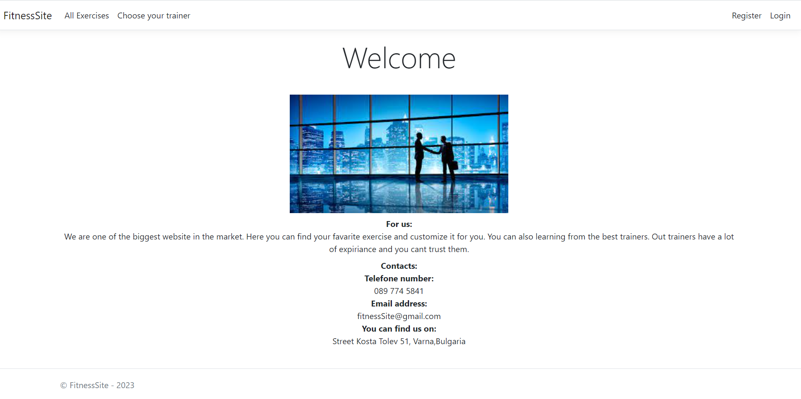
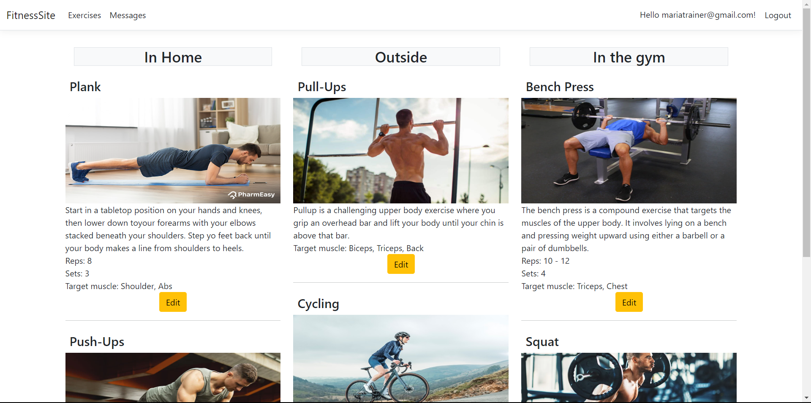
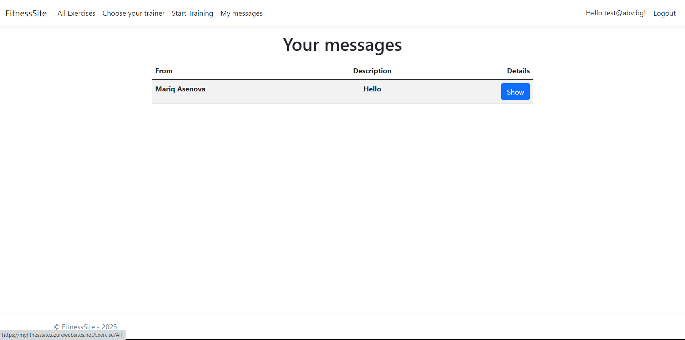
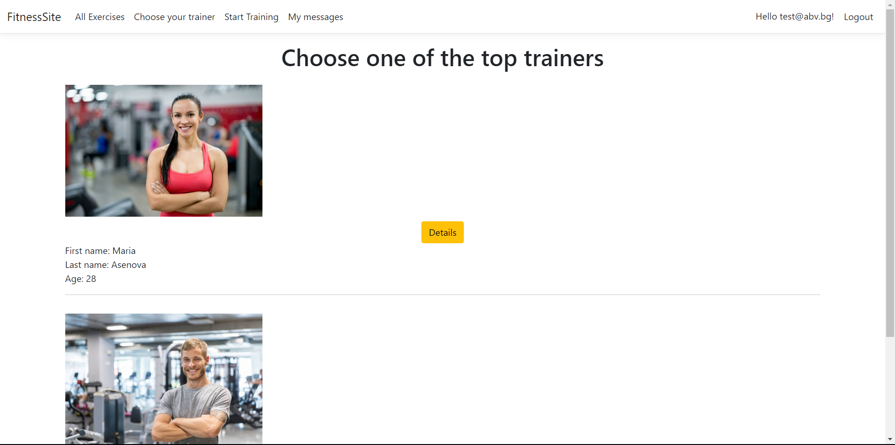
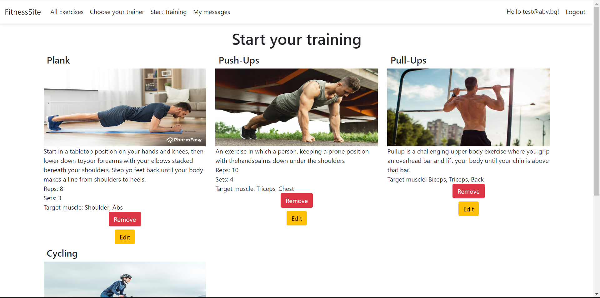

<h1>FitnessSite - C# Web App</h1>

This is my course work for C# Web Advanced 2023.

<h1>App Details</h1>

This app is based on ASP.NET Core MVC. 
I have 2 trainers: 
   <ol><li>ivantrainer@gmail.com with password - 123456 </li>
   <li>mariatrainer@gmail.com with password - 123456</li></ol>

 
 
<ul>
  <li>>NET 6</li>
  <li>SQL Database</li>
  <li>HTML</li>
  <li>MVC pattern</li>
  <li>Entity Framework Core</li>
  <li>Razor View Engine</li>
  <li>Bootstrap 5 </li>
</ul>

<h1>Live demo</h1>
<ul>
  <li>Web app live demo -   <a href="https://myfitnesssite.azurewebsites.net/">https://myfitnesssite.azurewebsites.net/</a></li>
</ul>

<h1>Functionality</h1>
<ul>
   <li>Guest user can see home page, all exercises and all trainers.</li>
   <li>Logged user can add exercise to training, edit their training, view trainers details and send them messages.</li>
   <li>Trainers can send messages to users, edit global exercises and accept user request.</li>
</ul>

<h1>Screenshots</h1>

 

 

 

 

                                                           

